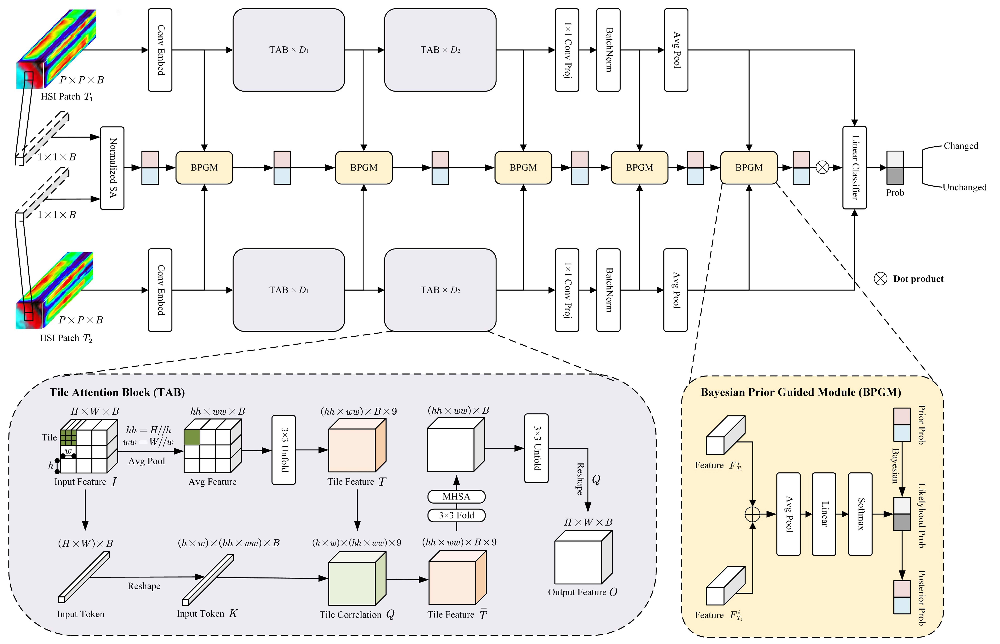

# BTCDNet: Bayesian Tile Attention Network for Hyperspectral Image Change Detection

***
# Introduction

<b> Official implementation of [BTCDNet](https://ieeexplore.ieee.org/document/10975807) by [Junshen Luo](https://github.com/JeasunLok), Jiahe Li, Xinlin Chu, Sai Yang, Lingjun Tao and Qian Shi. </b>
***



***
## How to use it?
### 1. Installation
```
git clone https://github.com/JeasunLok/BTCDNet.git && cd BTCDNet
conda create -n BTCDNet python=3.9
conda activate BTCDNet
pip install -r requirements.txt
```

### 2. Download our datasets

Download our datasets then place them in `data` folder:

Baiduyun: https://pan.baidu.com/s/1ifwTl8hITlfIEk_5kqEsuA?pwd=js66 
(access code: js66)

Google Drive: https://drive.google.com/drive/folders/1xe9i95_noh8dBW7sGn_z4uIfePBsa8r2

### 3. Quick start to use our SOTA model BTCDNet

<b> You should change the settings in `config.yaml` especially `HSI_data_path` and `model_type` then: </b>
```
chmod +x demo.sh
./demo.sh
```

### 4. More detailed information
see `config.yaml`

***
## Citation
<b> Please kindly cite the papers if this code is useful and helpful for your research. </b>

J. Luo, J. Li, X. Chu, S. Yang, L. Tao and Q. Shi, "BTCDNet: Bayesian Tile Attention Network for Hyperspectral Image Change Detection," in IEEE Geoscience and Remote Sensing Letters, vol. 22, pp. 1-5, 2025, Art no. 5504205, doi: 10.1109/LGRS.2025.3563897.

```
@article{luo2025btcdnet,
  title={BTCDNet: Bayesian Tile Attention Network for Hyperspectral Image Change Detection},
  author={Luo, Junshen and Li, Jiahe and Chu, Xinlin and Yang, Sai and Tao, Lingjun and Shi, Qian},
  journal={IEEE Geoscience and Remote Sensing Letters},
  year={2025},
  publisher={IEEE}
}
```

***
## Contact Information
Junshen Luo: luojsh7@mail2.sysu.edu.cn

Junshen Luo is with School of Geography and Planning, Sun Yat-sen University, Guangzhou 510275, China
***